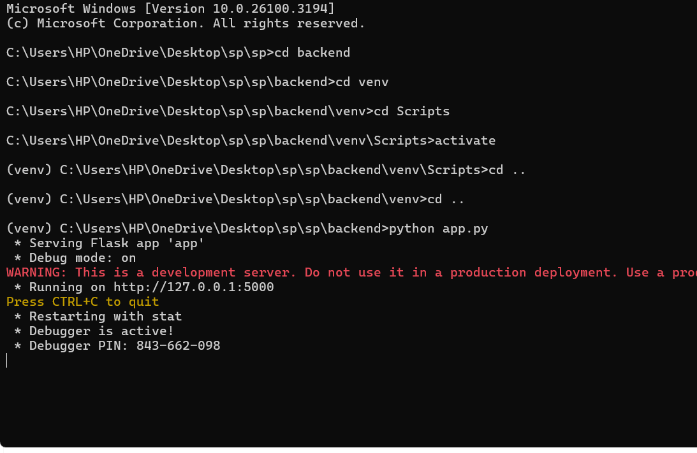
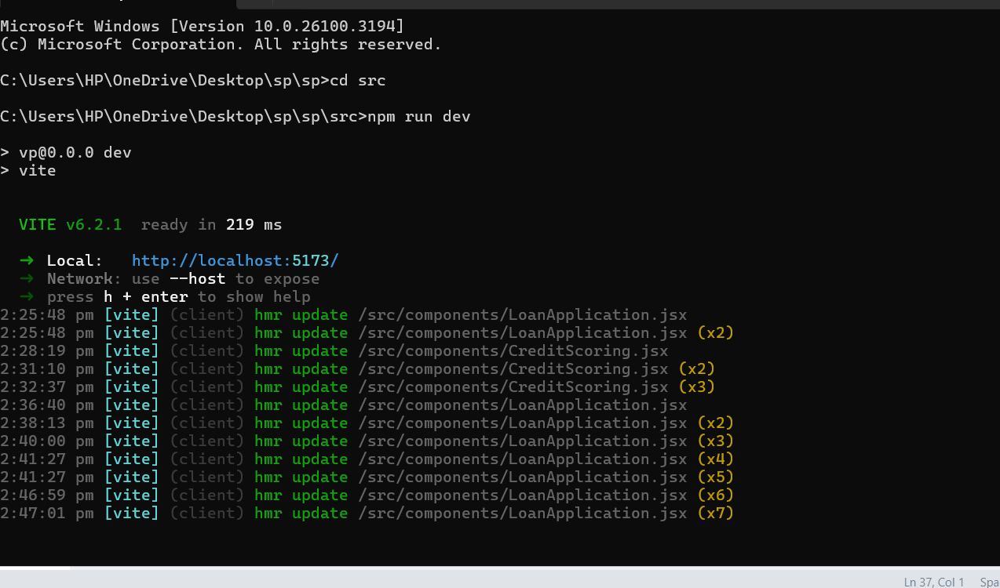

# Microloan Management System


A modern web application for managing microloans with **AI-powered credit scoring** and **fraud detection** capabilities.

---

## 📑 Table of Contents
- [Features](#features)
- [Demo](#demo)
- [Tech Stack](#tech-stack)
- [Installation](#installation)
- [Usage](#usage)
- [API Endpoints](#api-endpoints)
- [Development](#development)
- [Contributing](#contributing)
- [License](#license)

---

## ✨ Features

- **Loan Application Processing**: User-friendly interface for loan applications with real-time validation
- **AI Credit Scoring**: Advanced credit assessment using multiple data points including:
  - Income and employment history  
  - Phone usage patterns  
  - Transaction history  
- **Fraud Detection System**: Real-time fraud risk assessment with ML-based pattern analysis
- **Interactive Dashboard**: Visual representation of loan statistics and performance metrics
- **Detailed Loan Management**: Comprehensive view of individual loan details and payment tracking

---


## 🖼 Screenshots

### Dashboard


### AI Credit Scoring


### Loan Application


### Fraud Detection


### Console 1


### Console 2


## 🎥 Demo
### Video Walkthrough
[▶ Watch Demo](https://drive.google.com/file/d/1ZmyWaHnXvXw0pzUsOPAYbMjJ_EKHukS7/view?usp=sharing)


## 🛠 Tech Stack

### Frontend
- React.js with Vite  
- Material-UI (MUI) for UI components  
- React Router for navigation  
- Chart.js for data visualization  

### Backend
- Flask (Python)  
- ML models for credit scoring and fraud detection  
- CORS support for cross-origin requests  

---

## ⚙ Installation

### Prerequisites
- Node.js (v14 or higher)  
- Python 3.8 or higher  
- pip (Python package manager)  

### Frontend Setup
```bash
# Clone the repository
git clone https://github.com/veerammaramana-24/Microloan_Project.git

# Navigate to frontend
cd sp

# Install dependencies
npm install

# Start development server
npm run dev
```

### ⚙️ Backend Setup
```bash
# Clone the repository
git clone https://github.com/yourusername/loan-management.git
cd loan-management/backend

# Setup virtual environment
python -m venv venv
source venv/bin/activate

# Windows:
 venv\Scripts\activate

# Install dependencies
pip install flask flask-cors

# Run the server
python app.py
